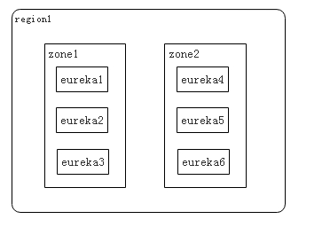
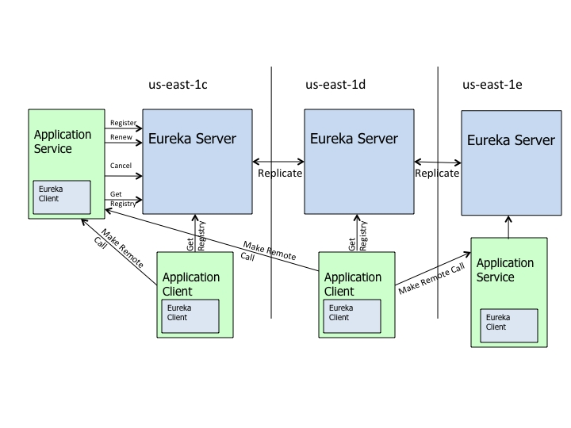
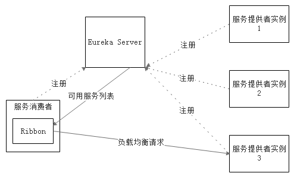

#SpringCloud
**快速构建分布式系统的工具集**
##特点

-约定优于配置
-开箱即用、快速启动
-适用于各种环境：PC,Docker,云
-轻量级的组件
-组件的支持很丰富，功能很齐全

##服务提供者与服务消费者

##服务发现与服务注册
-服务注册表
	服务注册表是一个记录当前可用服务实例的网络信息的数据库，是服务发现机制的核心。服务注册表提供查询API和管理API，使用查询API获得可用的服务实例，使用管理API实现注册和注销；
-服务注册
	服务注册很好理解，就是服务启动时，将服务的网络地址注册到服务注册表中；
-健康检查
	服务发现组件会通过一些机制定时检测已注册的服务，如果发现某服务无法访问了（可能是某几个心跳周期后），就将该服务从服务注册表中移除。

###服务发现的方式	
-客户端发现：Eureka,zk
-服务器端发现:Consul+nginx

###雪崩效应解决方案
-	超时机制
	通过网络请求其他服务时，都必须设置超时（资源耗尽)
-断路器模式
	-1.监控总共请求多少次，有多少次失败假设失败率达倒10%断路器打开
	-2.断路器的状态
	-3.分流
	-4.自我修复（断路器状态的切换）

##服务发现组件：Eureka
	Eureka是Netflix开发的服务发现框架，本身是一个基于REST的服务，主要用于定位运行在AWS域中的中间层服务，
	以达到负载均衡和中间层服务故障转移的目的。
	SpringCloud将它集成在其子项目spring-cloud-netflix中，以实现SpringCloud的服务发现功能。
Region和Zone的关系
	
	
	
	
上图是来自Eureka官方的架构图，大致描述了Eureka集群的工作过程。由于图比较复杂，可能比较难看懂，这边用通俗易懂的语言翻译一下：
-ApplicationService就相当于本书中的服务提供者（用户微服务），ApplicationClient就相当于本书中的服务消费者（电影微服务）；
-MakeRemoteCall，可以简单理解为调用RESTful的接口；
-us-east-1c、us-east-1d等是zone，它们都属于us-east-1这个region；

由图可知，Eureka包含两个组件：EurekaServer和EurekaClient。
EurekaServer提供服务注册服务，各个节点启动后，会在EurekaServer中进行注册，这样EurekaServer中的服务注册表中将会存储所有可用服务节点的信息，服务节点的信息可以在界面中直观的看到。

EurekaClient是一个Java客户端，用于简化与EurekaServer的交互，客户端同时也具备一个内置的、使用轮询（round-robin）负载算法的负载均衡器。

在应用启动后，将会向EurekaServer发送心跳（默认周期为30秒）。如果EurekaServer在多个心跳周期内没有接收到某个节点的心跳，EurekaServer将会从服务注册表中把这个服务节点移除（默认90秒）。

EurekaServer之间将会通过复制的方式完成数据的同步。（详见Eureka高可用章节）

Eureka还提供了客户端缓存的机制，即使所有的EurekaServer都挂掉，客户端依然可以利用缓存中的信息消费其他服务的API。

综上，Eureka通过心跳检测、健康检查、客户端缓存等机制，确保了系统的高可用性、灵活性和可伸缩性。

---
##Ribbon是什么
Ribbon是Netflix发布的云中间层服务开源项目，其主要功能是提供客户端侧负载均衡算法。
Ribbon客户端组件提供一系列完善的配置项如连接超时，重试等。简单的说，Ribbon是一个客户端负载均衡器，
我们可以在配置文件中列出LoadBalancer后面所有的机器，Ribbon会自动的帮助你基于某种规则（如简单轮询，随机连接等）
去连接这些机器，我们也很容易使用Ribbon实现自定义的负载均衡算法。

Ribbon工作时分为两步：
-第一步先选择EurekaServer,它优先选择在同一个Zone且负载较少的Server；
-第二步再根据用户指定的策略，在从Server取到的服务注册列表中选择一个地址。其中Ribbon提供了多种策略，
例如轮询roundrobin、随机Random、根据响应时间加权等

##API网关

[「ChrisRichardson微服务系列」使用API网关构建微服务](http://blog.daocloud.io/microservices-2/)

ZuulAPIGateway